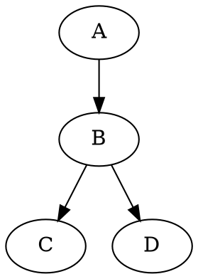

<!-- @import "[TOC]" {cmd="toc" depthFrom=1 depthTo=6 orderedList=false} -->

<!-- code_chunk_output -->

- [尝试使用 MPE 书写论文数学公式](#尝试使用-mpe-书写论文数学公式)
  - [特征提取相关公式](#特征提取相关公式)
    - [AAC 和 PseAAC 公式](#aac-和-pseaac-公式)
    - [CKSAAP 计算公式](#cksaap-计算公式)
    - [PSSM 相关公式](#pssm-相关公式)
  - [特征排序相关公式](#特征排序相关公式)
  - [其它 MPE 元素](#其它-mpe-元素)

<!-- /code_chunk_output -->

# 尝试使用 MPE 书写论文数学公式

## 特征提取相关公式

### AAC 和 PseAAC 公式

$$
    x_{i}=\begin{cases}
        \dfrac{f_{i}}{\sum_{j=1}^{20}f_{j}+w\sum_{j=1}^{\lambda}\theta_{j}},\left ( 1 \leq i \leq 20 \right ) \\
        \dfrac{w\theta_{i-20}}{\sum_{j=1}^{20}f_{j}+w\sum_{j=1}^{\lambda}\theta_{j}},\left ( 21\leq i \leq 20+\lambda \right )
    \end{cases}
$$

$$ \theta_{j}=\frac{1}{L-j}\sum_{i=1}^{L-j}\Theta_{R_{i},R{i+j}} $$

$$ \Theta_{R_{i},R_{i+j}}=\frac{1}{3} \{ \left[ H_{1}(R_{j}) - H_{1}(R_{i}) \right]^2 + \left[ H_{2}(R_{j}) - H_{2}(R_{i}) \right]^2 \\
    + \left[ M(R_{j}) - M(R_{i}) \right]^2 \} $$

$$
    \begin{cases}
        H(R_{i})=\frac{H(R_{i})-\sum_{i=1}^{20}\frac{H(R_{i})}{20}}{\sqrt{\frac{\sum_{i=1}^{20}\left[ H(R_{i})- \sum_{i=1}^{20}\frac{H(R_{i})}{20}\right]^2}{20}}} \\
        M(R_{i})=\frac{M(R_{i})-\sum_{i=1}^{20}\frac{M(R_{i})}{20}}{\sqrt{\frac{\sum_{i=1}^{20}\left[ M(R_{i})- \sum_{i=1}^{20}\frac{M(R_{i})}{20}\right]^2}{20}}}
    \end{cases}
$$

$$
    \begin{bmatrix}
        x_{1} & x_{2} & \ldots x_{20} & x_{20+1} & \ldots & x_{20+20}
    \end{bmatrix}
$$

### CKSAAP 计算公式
$$
    \underbrace{( \frac{N_{AA}}{N_{Total}},\frac{N_{AC}}{N_{Total}},...,\frac{N_{i,j}}{N_{Total}},...,\frac{N_{YY}}{N_{Total}} )}_{400}
$$

### PSSM 相关公式
$$ 
    \mathbf{X}_{PSSM}=
        \begin{bmatrix}
            x_{1,1} & x_{1,2} & \ldots & x_{1,20}\\
            x_{2,1} & x_{2,2} & \ldots & x_{2,20}\\
            \vdots & \vdots & \ddots & \vdots\\
            x_{21,1} & x_{21,2} & \ldots & x_{21,20}\\
        \end{bmatrix}
$$

## 特征排序相关公式

## 其它 MPE 元素

| a | b |
|---|---|
| c | d |
